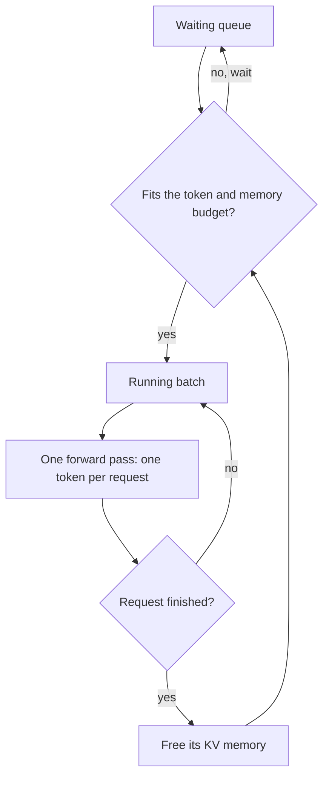

Your LLM API call took three times longer to start at 3pm than at 9am. Your prompt did not change, your code sent the same bytes, and the answer was the same. The explanation is not in your code. It is inside the server, in the requests from other people that arrived at the same second as yours.

This essay explains how an LLM inference server shares one GPU between many requests. It covers the scheduler loop that decides whose token comes next, the batching policy that fills the GPU, and the memory allocator that decides how many requests fit at once. When you finish, you can explain a latency spike from first principles. You can also compute, on paper, how many concurrent requests one GPU holds.

## One request is never alone on a server

Start with one request, because that is the model you probably have in your head. A prompt arrives. The server runs prefill, one pass over the whole prompt that produces the first token. Then it runs decode, one pass per token after that. A forward pass is one run of the model over a set of tokens. The time to first token is called TTFT. The time per later token is called TPOT.

That one-request model is correct but incomplete. A real server runs a loop over a batch. Each iteration of the loop does five things:

1. Look at the waiting queue and the running set.
2. Pick work that fits a token budget and a memory budget.
3. Run one forward pass over all of it together.
4. Every decoding request gets exactly one new token.
5. Finished requests leave, and their memory returns to the pool.

Step 4 is the one that surprises. One iteration produces one token per request. A batch of 40 requests therefore produces 40 tokens in about the time one request takes for one token.




## A decode iteration reads the weights once for the whole batch

The reason needs one layer of detail. A decode step must read every model weight from GPU memory into the compute units, because producing one token requires the whole model. That read is the expensive part. Once the weights are loaded, the arithmetic for one sequence is a small set of vector operations. A second sequence uses the same loaded weights for almost no extra time. So the cost of a decode iteration is set by reading the weights, not by how many sequences are in the batch. The Databricks team measured this in its post "LLM Inference Performance Engineering: Best Practices" (October 2023): at batch size 1, model bandwidth utilisation on an A100 was only about 55% to 60%. Memory reads set the speed while compute has spare capacity.

A small teaching simulator makes this concrete. It encodes that fact in three constants:

```
BASE_DECODE_MS = 18.0        # one decode iteration with a batch of 1
PER_SEQ_DECODE_MS = 0.12     # extra cost per additional sequence
MS_PER_PREFILL_TOKEN = 0.03  # prefill cost per prompt token
```

With these constants, a batch of 16 decoding requests costs 18.0 + 0.12 x 16 = 19.92ms per iteration. A batch of 1 costs 18.12ms. Sixteen times the tokens cost about 10% more time. These constants are a teaching model. The ratios match how real servers behave, but the numbers match no specific GPU. Every latency table in this essay comes from this simulator, and the section on limits says what that means for how much you should trust them.

## Static batching wastes GPU time between requests

The old way to batch was static. Collect N requests, run them together, and admit no new request until the last one finishes.

The failure is easy to draw. Four slots run requests of different lengths:

```
slot 1  done at t=1.2s, then unused until t=3.1s
slot 2  done at t=2.4s, then unused
slot 3  done at t=3.1s
slot 4  done at t=0.6s, then unused
new requests wait for t=3.1s
```

A slot is a place in the batch plus the GPU memory reserved behind it. When a short request finishes at t=0.6s, its slot stays occupied and its memory stays reserved. Neither produces tokens. The slowest request in the batch decides when everyone else's memory is released. This is an instance of head-of-line blocking: one slow item at the front of a queue holds back every item behind it.

## Continuous batching refills the slot on the next iteration

The fix is to move the admission decision from batch level to iteration level. The scheduler checks on every iteration whether a slot is free. A finished request leaves at once, and a waiting request takes its slot on the next step.

This is continuous batching, also called iteration-level scheduling. The Orca paper introduced it (Yu et al., 2022, published at the OSDI systems conference). Against FasterTransformer's static batching, Orca served 36.9x more throughput at the same latency. That test used GPT-3 175B on 16 A100 40GB GPUs. vLLM, SGLang and TensorRT-LLM all run this loop today.

### The measured trade

The simulator ran 40 requests arriving at 6 per second, under both batching policies:

| policy | mean TTFT | p99 TTFT | mean TPOT | throughput |
|---|---|---|---|---|
| static | 5,357ms | 9,215ms | 19.4ms | 2.3 rq/s |
| continuous | 867ms | 2,649ms | 25.4ms | 3.6 rq/s |

Three effects appear together. Mean TTFT fell 6.2x, from 5,357ms to 867ms. Throughput rose 57%, from 2.3 to 3.6 requests per second. Mean TPOT rose from 19.4ms to 25.4ms, about 31% slower per token. A fuller batch decodes each token a little slower, and that is the price.

The third effect is a trade, not a bug. You pay 6ms per token and save 4.5 seconds on the first token. For a 200-token answer the cost is 1.2 seconds against a saving of 4.5 seconds. The trade favours continuous batching. The Anyscale team measured the same direction on real hardware in June 2023: continuous batching alone gave up to 8x throughput on OPT-13B on one A100 40GB, against static FasterTransformer batching.

### The arrival rate, not your prompt, moves your TTFT

Now return to the question this essay opened with. In the simulator, doubling the arrival rate from 6 to 12 requests per second, with the same prompts, gives:

| policy | mean TTFT at 6/s | mean TTFT at 12/s |
|---|---|---|
| static | 5,357ms | 6,551ms |
| continuous | 867ms | 1,674ms |

Nothing about your request changed. Mean TTFT rose about 1.9x, because more requests waited in the queue and shared the batch. This is a simulation of uniform short prompts, so read it as the direction and the mechanism, not as a prediction of your spike. Your real queue also holds longer prompts and other tenants, and this simulator does not model either. When your TTFT jumped at 3pm, the cause was the arrival rate, not your prompt. On a hosted API you cannot see the queue. You see only its effect on your TTFT.

```widget chart
{"type": "line", "title": "Mean time to first token when arrivals double", "unit": "milliseconds", "labels": ["6 requests per second", "12 requests per second"], "series": [{"name": "Static batching", "values": [5357, 6551]}, {"name": "Continuous batching", "values": [867, 1674]}], "caption": "From the teaching simulator: 40 short, uniform prompts. The prompts are the same at both rates."}
```


### Retrying makes a queue longer

<aside class="callout warn">Do not retry when the first token is slow. A retry is one more request in the same queue, so it makes the wait longer for everyone, including you.</aside>

The instinct at this point is to retry when TTFT passes a threshold. A retry adds one more request to the same queue. The queue grows longer and the spike gets worse. On a provider API, back off instead. On your own server, recent vLLM versions can refuse work instead of queueing it. vLLM v0.29.0, released in September 2026, added two flags, `--max-num-queued-reqs` and `--max-num-queued-tokens`. Once the queue limit is hit, a new request is rejected with HTTP 503 instead of waiting. The docstring for these flags in vllm/config/scheduler.py at that release describes them as a TTFT quality-of-service control, meant to be set near your target TTFT multiplied by prefill throughput.

## Slots are only half the resource; memory runs out first

Continuous batching fills slots. The harder limit is the KV cache memory behind each slot. The <dfn>KV cache</dfn> holds the key and value vectors the model computes for every token it has seen. The model re-reads them on every decode step, so they must remain in GPU memory.

The simple allocator reserves memory for the worst case, because the server cannot know how long the answer will be. For a model that accepts sequences up to 32,768 tokens, each request reserves 32,768 token slots even if it uses 1,800. On an 80GB GPU with llama-3-8b, the KV pool left after the weights is about 56GB, so:

```
56 GB pool / 4.00 GB reserved per request = 14 concurrent requests
52.9 GB of the pool is reserved but unused
```

The PagedAttention paper (Kwon et al., 2023, published at the SOSP operating systems conference) measured this waste in production serving systems. Only 20.4% to 38.2% of KV cache memory held real token state in those systems. Reserved space and fragmentation consumed the rest.

## PagedAttention applies the virtual memory idea to the KV cache

The fix uses the same idea your operating system uses for RAM. A contiguous reservation gives every process one large region sized for the most it could ever use. Virtual memory instead cuts memory into fixed-size pages and hands them out on demand. The server does the same with the KV cache. It splits the cache into fixed-size blocks and allocates a block only when the sequence needs it. A block table per sequence maps each logical position to a physical block. The blocks of one sequence do not need to sit next to each other in memory.

The simulator computes the cost in two functions:

```python
def kv_bytes_per_token(layers, kv_heads, head_dim, dtype):
    return 2 * kv_heads * head_dim * BYTES_PER_VALUE[dtype] * layers

def blocks_for(tokens, block_size):
    return -(-tokens // block_size)  # ceiling division
```

Each token in the KV cache stores two sets of vectors, one key and one value. That is where the 2 in the formula comes from. The size of those vectors is set by two numbers from the model architecture. One is kv_heads, the number of attention key-value heads per layer (8 for llama-3-8b). The other is head_dim, the width of each head's vector (128). Each value is stored in fp16, 16-bit floating point, which costs 2 bytes. The token pays this cost on every one of the model's 32 layers.

For llama-3-8b in fp16: 2 x 8 x 128 x 2 bytes x 32 = 131,072 bytes, so each token costs 128KB of cache.

The calculator below uses the same formula. Set the context to 32,768 tokens to see the contiguous case, where each request reserves 4 GB.

```widget kv-calculator
{"layers": 32, "kvHeads": 8, "headDim": 128, "bytesPerValue": 2, "gpuGb": 80, "util": 0.90, "weightsGb": 16, "context": 32768}
```

### The measured capacity gain

Running the arithmetic end to end on the same 80GB GPU, with requests that hold 1,800 tokens each on average:

| | contiguous reservation | paged, 16-token blocks |
|---|---|---|
| reserved per request | 32,768 tok | 1,808 tok |
| bytes per request | 4.00 GB | 0.22 GB |
| concurrent requests | 14 | 253 |
| memory wasted | 52.9 GB | 0.2 GB |

Paging admits 18.1x more concurrent requests on the same hardware. The model and the GPU did not change. How much of the old waste paging removes in practice is a claim that could be verified only as a statement by the vLLM authors: in their talk "Fast LLM Serving with vLLM and PagedAttention" (Kwon and Li) they say paging cut KV memory waste to about 4%, and an Anyscale blog post repeats that figure, quoting vLLM's own blog for "under 4%". No written measurement method was found behind the number, so treat the exact figure as the authors' claim. The 18.1x above, by contrast, is arithmetic you can redo yourself from the per-token cost.

The waste that remains is the partial last block. A 1,800-token request holds 113 blocks of 16 tokens, which is 1,808 token slots, so 8 slots go unused. That is the only waste this design leaves. It shrinks when the block size shrinks.

### A shared prefix multiplies the capacity

When every request starts with the same 1,200-token system prompt, the server stores that prefix once. Every request's block table points at the same physical blocks for those tokens. With the numbers above:

```
pool = 28,672 blocks of 16 tokens (56 GB at 128 KB per token)
shared prefix = 75 blocks, stored once
private per request = ceil(600 / 16) = 38 blocks
(28,672 - 75) / 38 = 752 concurrent requests
```

That is 2.97x more than paging without sharing, and 54x more than contiguous reservation. This arithmetic is one reason to keep a system prompt stable and at the start of every request.

```widget chart
{"type": "bar", "title": "Concurrent requests on one 80 GB GPU", "labels": ["Contiguous reservation, 32,768 tokens each", "Paged, 16-token blocks", "Paged, with a shared 1,200-token prefix"], "series": [{"name": "Requests", "values": [14, 253, 752]}], "caption": "56 GB KV pool, llama-3-8b, 1,800 tokens per request. Arithmetic from the per-token cost, not measured."}
```


## A worked example you can check by hand

The two halves of this essay now come together in one capacity calculation. One 80GB GPU runs llama-3-8b at 0.90 memory utilisation. vLLM's default at v0.29.0 is 0.92; 0.90 keeps the numbers round. The weights take 16GB, the KV pool is 56GB, the block size is 16, and each request holds 1,800 tokens.

1. One request holds ceil(1800 / 16) = 113 blocks = 1,808 token slots.
2. One request costs 1,808 x 128KB = 0.2207 GB of KV memory.
3. 56 / 0.2207 = 253 concurrent requests.
4. Each decode iteration gives every running request one token.
5. With 253 requests in the running set, the simulator's cost model gives 18.0 + 0.12 x 253 = 48.4ms per iteration. Each request sees a new token about every 48ms.

Now let 350 requests arrive at once. 253 run and 97 wait. Each waiting request stays in the queue while 48.4ms iterations pass. At 6 arrivals per second the queue empties between bursts, and the simulated mean TTFT of 867ms holds. At 12 arrivals per second the queue never empties and the simulated mean climbs to 1,674ms. Your prompt is the same length both times.

One more capacity check, because your platform team will ask. vLLM's `gpu_memory_utilization` setting decides what share of GPU memory the server may use, and it reads as a safety margin. Lower it from 0.90 to 0.70 and the arithmetic is: 80GB x 0.70 = 56GB usable, minus the same 16GB of weights, which leaves a 40GB pool. Then 40 / 0.2207 = 181 concurrent requests instead of 253. That is 28.5% of capacity gone. Every point of that setting costs concurrency, so decide it as a capacity number, not as a safety number.

## The knobs that matter

You do not control a provider's scheduler. You control four inputs to it:

- **Prompt length.** A long prefill uses the iteration's token budget and delays every decoding request in the batch.
- **Output length.** A long generation holds a slot and its KV memory for the whole time.
- **Arrival pattern.** 50 requests at once wait in a queue. 50 spread over a minute do not. Retries make the pattern worse, not better.
- **Prefix reuse.** A cached prefix skips prefill, so it does not compete for the token budget.

On your own server, the settings are `block_size`, `gpu_memory_utilization`, `max_num_seqs`, and the v0.29.0 queue limits described above. The vLLM default block size is 16 tokens. Smaller blocks waste less and share more. The scheduling policy is first-come-first-served by default, with priority as the only alternative at v0.29.0.

## Where this stops working

Four limits matter in practice, and the fourth is about how much you should trust the numbers in this essay.

First, the longest pause. The continuous batching run shows a worst gap of 764ms between two tokens of one answer, while mean TPOT in the same run is only 25.4ms. The cause is a large prefill consuming the token budget for many iterations in a row. Serving engines limit this with chunked prefill, which caps how many prompt tokens one iteration may read. That mechanism deserves its own essay.

Second, preemption. When the block pool runs out, the scheduler does not return an error. It frees a running request's blocks and puts the request back in the queue. Later it re-runs that request's prefill from the start. The user sees the answer stop mid-sentence for seconds. No error appears in your logs, because preemption is a normal scheduler operation. When admission consistently lets in more sequences than the pool holds, this repeats and throughput collapses while GPU utilisation stays high, so a utilisation-only dashboard looks healthy.

Third, every concurrency number here is an upper bound under ideal conditions. Real traffic brings longer prompts, uneven lengths and other tenants. Prefix sharing behaves differently under a shared cache, and hit rates in production are far below 100%. Measure on your own stack before you size a cluster.

Fourth, the latency tables come from a teaching simulator, not from a GPU. The three constants shown above are the only physics in it. They produce the right shape of behaviour, but the absolute numbers match no specific hardware. The simulator scripts are not published yet, so you cannot rerun the tables as given. The arithmetic sections of this essay depend only on the KV per-token formula and the pool size, and you can verify those by hand. The Orca and Anyscale numbers come from their published benchmarks on fixed models and hardware, which were not re-run for this essay.

## Latency comes from what else is in the batch

One scheduler iteration gives every running request one token. Throughput comes from batch size, but latency comes from what else is in the batch. The batch size is set by how you allocate KV memory, not by the model. When your TTFT rises at a busy hour, check the arrival rate and queue depth before you touch prompts or code. When you size a GPU, do the paging arithmetic in order: weights first, then the pool, then blocks of 16 at the model's per-token cost. A queued request is never helped by adding another request. Back off instead of retrying, and on your own server refuse excess work with a 503 instead of letting the queue grow.
